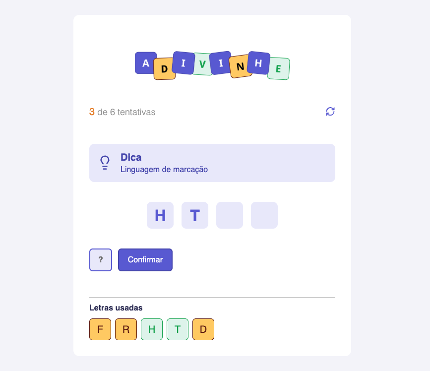

# Word Guess Game 

  
  
  

Um jogo de adivinhar palavra desenvolvido com **React + TypeScript**, focado em **componentização**, **gerenciamento de estado** e **lógica de validação**.  
Você recebe uma **dica**, digita **uma letra por vez** e tenta completar a palavra antes de estourar o limite de tentativas.

---

## Essa aplicação permite:

-  Sortear uma palavra aleatória a partir do array `WORDS`
-  Exibir dica (`tip`) do desafio atual
-  Digitar **1 letra** e confirmar por botão ou tecla **Enter**
-  Validar letra (A–Z) e impedir repetição
-  Revelar letras corretas na palavra (inclui letras repetidas)
-  Contabilizar erros no **score** (tentativas)
-  Detectar **vitória** ao completar a palavra
-  Detectar **game over** ao atingir o limite de tentativas e reiniciar automaticamente
-  Reiniciar o jogo manualmente (novo desafio)

---

## Tecnologias e funcionalidades

- React → Biblioteca de UI
- TypeScript → Tipagem e segurança (ex.: `Challenge`, `LetterUsedProps`)
- useState → Controle de estados (`challenge`, `letter`, `tip`, `lettersUsed`, `score`)
- useEffect → Início automático do jogo (`startGame()` ao montar)
- CSS Modules → Estilização escopada por componente
- Regex (validação) → Aceita apenas letras A–Z (`/^[A-Z]$/`)

---

## Componentes principais

- **Header** → Exibe tentativas atuais e botão de reinício
- **Tip** → Mostra a dica do desafio
- **Input** → Campo de entrada (1 caractere) com suporte a Enter
- **Button** → Botão de confirmar (muda status: `playing` / `win`)
- **Letter** → Renderiza cada posição da palavra (letra ou vazio)
- **LetterUsed** → Lista de letras usadas com status (correta/errada)

---

## Funcionamento

1. Ao iniciar, o jogo chama `startGame()` e escolhe um item aleatório do array `WORDS`.
2. O usuário digita uma letra:
   - Se for inválida → alerta e limpa o input
   - Se já foi usada → alerta e limpa o input
3. Se a letra existir na palavra → adiciona em `lettersUsed` como `correct: true`
4. Se não existir → incrementa `score`
5. Se `score` atingir `challenge.attemps` → **Game Over**, mostra a palavra e reinicia

### Vitória (wordComplete)

A vitória é detectada verificando se **cada letra da palavra** já foi descoberta em `lettersUsed` com `correct: true`.  
Isso garante que letras repetidas na palavra também sejam tratadas corretamente.
